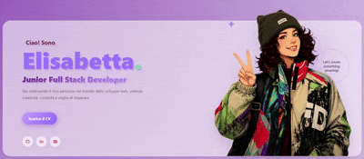
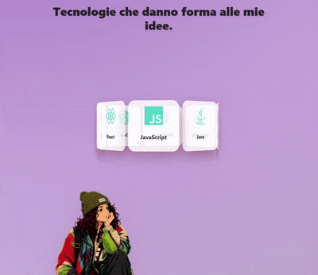
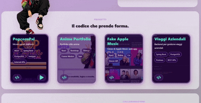

# My Anime Portfolio

A modern and interactive personal portfolio built with **React**, inspired by anime aesthetics and immersive UI experiences.

The project showcases my work as a Full Stack Developer through smooth animations, responsive layouts, interactive components and multilingual support.

---

## Live Demo

🌐 https://anime-portfolio-ep.vercel.app/



---

## Features

- ✨ Anime-inspired UI and visual identity
- 🌍 Internationalization (Italian / English)
- 📄 Dynamic CV download based on the selected language
- 🎬 Smooth page animations
- 🎨 Interactive glassmorphism effects
- 🧩 Responsive design for desktop, tablet and mobile
- 📬 Quick access to GitHub, LinkedIn and email

---

## Tech Stack

### Frontend

- React
- JavaScript (ES6+)
- Vite
- Sass (SCSS)
- Bootstrap

### Animation & UI

- Motion
- React Three Fiber
- React Icons

### Multilanguage

- react-i18next
- i18next

---

## SEO & Performance

- Custom domain
- Open Graph metadata
- Structured Data (Schema.org)
- Sitemap.xml
- Robots.txt
- Responsive design
- Lighthouse optimized

---

## Interactive Animations

### Dynamic Octagon



### Glass Card Effect



---

## Installation

```bash
git clone https://github.com/yourusername/anime-portfolio.git

cd anime-portfolio

npm install

npm run dev
```

---

## Build

```bash
npm run build
```

---

## Author

**Elisabetta Piacquadio**

- Portfolio: https://anime-portfolio-ep.vercel.app/
- LinkedIn: https://linkedin.com/in/elisabettapiacquadio
- GitHub: https://github.com/<tuo-username>
